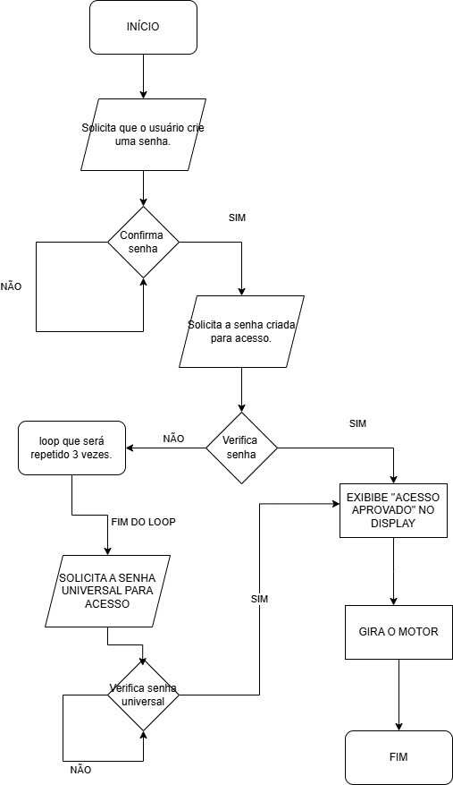
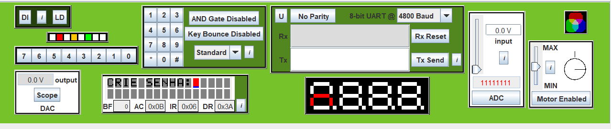
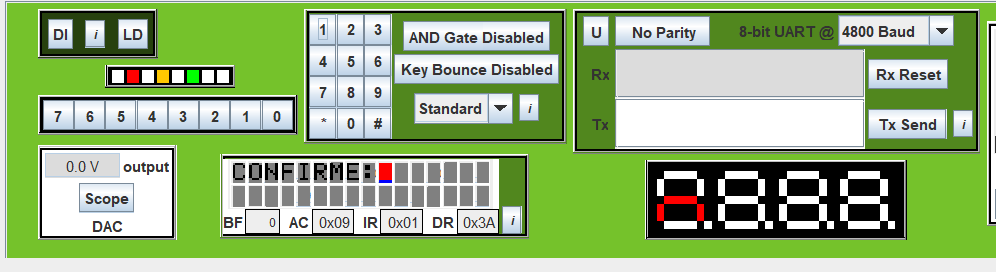
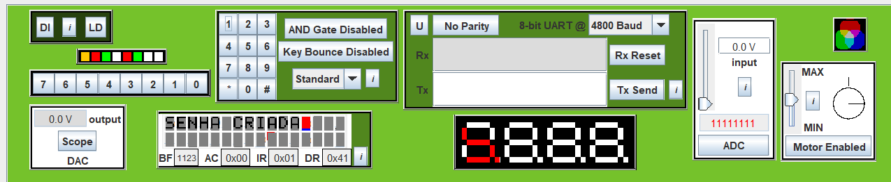
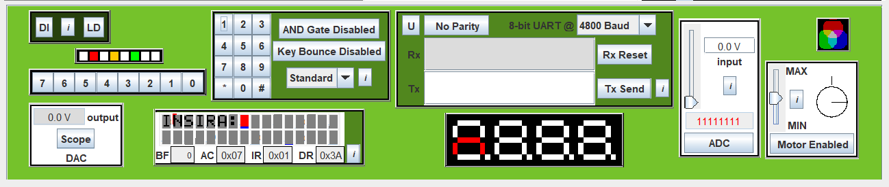
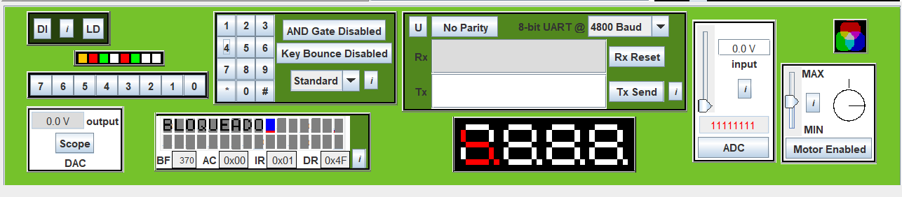
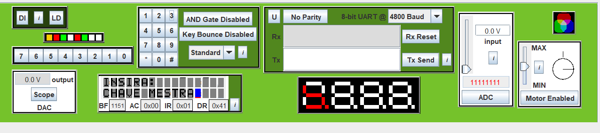
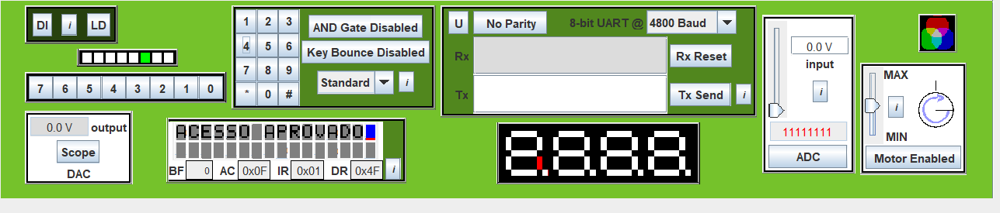

# Projeto de Arquitetura de computadores.

# ALUNOS:
- Henrique Finatti 22.123.030-3
- Tiago Fagundes 22.123.017-0

# Projeto: Tranca Digital com senha em Assembly.
Esse projeto tem como objetivo o desenvolvimento de uma aplicação que simula uma porta digital, utilizando a linguagem Assembly.

# Descrição e Objetivo:
O objetivo deste projeto é desenvolver um sistema de acesso em que o usuário cria uma senha de entrada. Após a criação, o usuário deve confirmar a senha. Se a confirmação estiver correta, uma mensagem de aprovação será exibida e, em seguida, o motor irá girar, simulando a abertura de uma porta digital. O usuário terá três tentativas para inserir a senha correta; caso não consiga, será solicitado que digite uma senha universal para acessar a porta digital. O sistema permanecerá em loop até que a senha universal seja inserida corretamente, resultando no mesmo comportamento de sucesso.

# Componentes Utilizados:
- Microcontrolador 8051
- Teclado Matricial 4x4
- Display LCD

# Diagrama:

# Imagens do programa:

- Solicitação ao usuário para criar senha:

  

- Confirmação da senha:

  

- Mensagem de senha criada:

  

- Solicitação da senha criada para acesso a porta digital:

  

- Caso o usuario erre a senha 3 vezes, o nosso programa irá bloquear e pedir a senha mestre:

  

  

- Quando o usuário acertar a senha que ele criou ou a senha mestre, irá retornar uma mensagem e o motor irá girar:

      -

    

  

